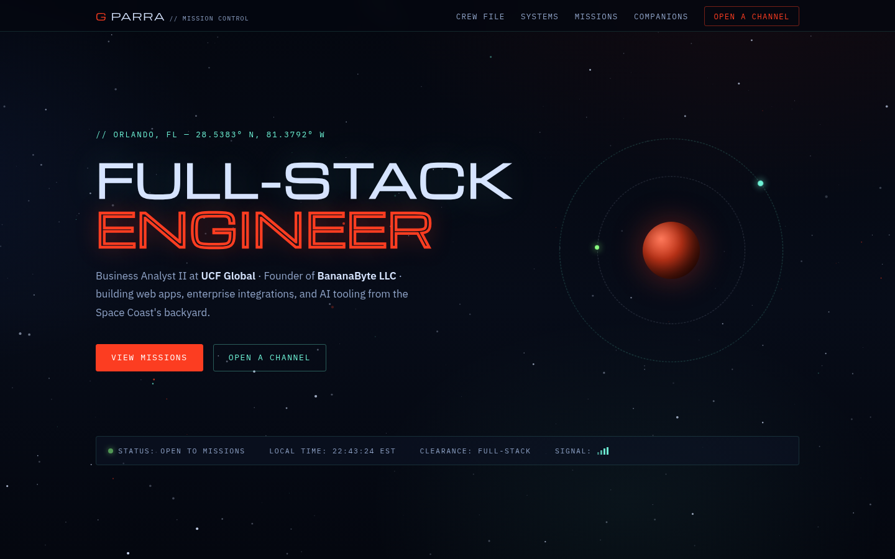

# Gabriel Parra — Portfolio

Live at **[gabrielparra.dev](https://gabrielparra.dev)**



My personal portfolio site — a "Mission Control" themed single-page app covering experience, skills, and projects, plus a couple of easter eggs for anyone who pokes around.

## Features

- **Crew File** — background, experience timeline, and certifications
- **Systems** — languages, frameworks, platforms, and game-dev tooling
- **Missions** — curated project cards linking out to source repos
- **Transmissions** — a live feed of recent GitHub activity, pulled via a Vercel serverless function
- **Open a Channel** — contact form (EmailJS) plus direct links
- Animated canvas starfield, Konami-code and click easter eggs
- A bonus retro arcade (Snake, Tetris, Breakout, Blackjack, and more) tucked behind the easter eggs

## Stack

React 19 + Vite 7, vanilla CSS, EmailJS for the contact form, and a Vercel serverless function (`api/github-repos.js`) proxying the GitHub API.

## Setup

```bash
npm install
npm run dev
```

```bash
npm run build   # production build
npm run lint     # ESLint
```

Requires `GITHUB_TOKEN` and the `VITE_EMAILJS_*` keys as environment variables in production (see Vercel project settings).
